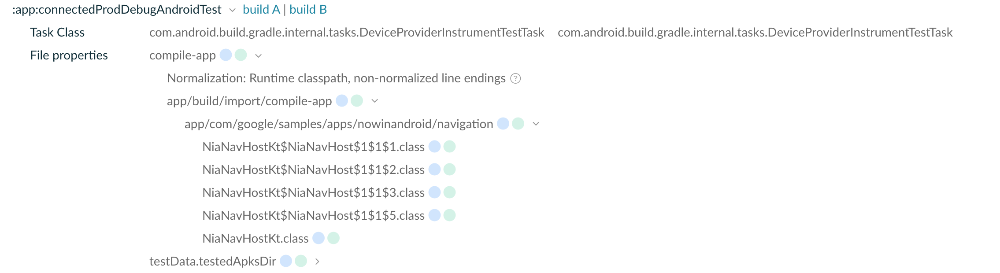

## Import Inputs Plugin

This plugin collects the relevant AndroidTest inputs for test/tested APKs in the Instrumentation variants.

### Usage

In the module where you are running instrumentation tests, add the plugin:

```kotlin
plugins {
    ...
    id("io.github.cdsap.import-inputs") version "0.0.1"
}
```

Depending on your configuration, add the Import Inputs to the Instrumentation test task:
```kotlin
tasks.withType<DeviceProviderInstrumentTestTask>().configureEach {
    InputsImporter.add(project, "importInputsProdDebugAndroidTest", this)
}
```

Or to the JUnit import report task:
```kotlin
afterEvaluate {
    val syntheticImportOutput = project.layout.buildDirectory.file("outputs/importJUnitXml/output")
    ImportJUnitXmlReports.register(
        tasks,
        tasks.named("connectedProdDebugAndroidTest"),
        JUnitXmlDialect.ANDROID_CONNECTED
    ).configure {
        dialect.set(JUnitXmlDialect.ANDROID_CONNECTED)
        InputsImporter.addWithClasses(project, nameTask = "importInputsProdDebugAndroidTest", this)
        reports.from(fileTree("${project.layout.buildDirectory.get()}/outputs/androidTest-results"))
        outputs.file(syntheticImportOutput)
        doLast {
            syntheticImportOutput.get().asFile.createNewFile()
        }
    }
}
```

**Note:**
The task name `importInputsProdDebugAndroidTest` represents the import task and corresponds to the build variant `ProdDebug`.
For a simple scenario without flavors, use `importInputsDebugAndroidTest`.

### Importing Options Mode
* If you are decorating the Android test task (e.g., DeviceProviderInstrumentTestTask), you do not need to explicitly define test Kotlin/Java classes, as these tasks track the inputs independently. Use:
```kotlin
InputsImporter.add(project, importTaskName, taskDecorated)
```

* If you are using ImportJUnitXmlReports, you must explicitly define those inputs:
```kotlin
InputsImporter.addWithClasses(project, importTaskName, taskDecorated)
```

## Inputs Tracked

| Input Name                                      | Description                     | Optional |
|------------------------------------------------|---------------------------------|----------|
| `compile_app_classes_jar`                      | Compiled app classes JAR       | No       |
| `compile_and_runtime_not_namespaced_r_class_jar` | R class JAR for compile/runtime | No       |
| `compile_library_classes_jar`                  | Compiled library classes JAR   | No       |
| `kotlin-classes`                               | Kotlin compiled classes        | Yes      |
| `testJavaClasses`                              | Compiled test Java classes     | Yes      |

## Example diff input

